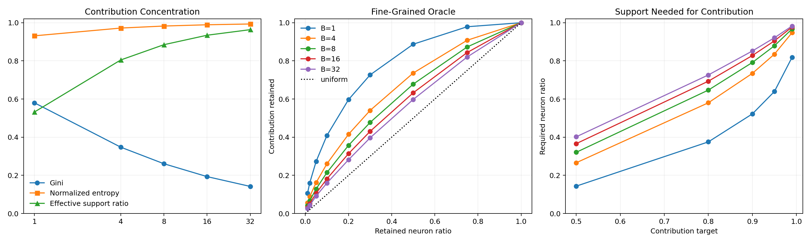
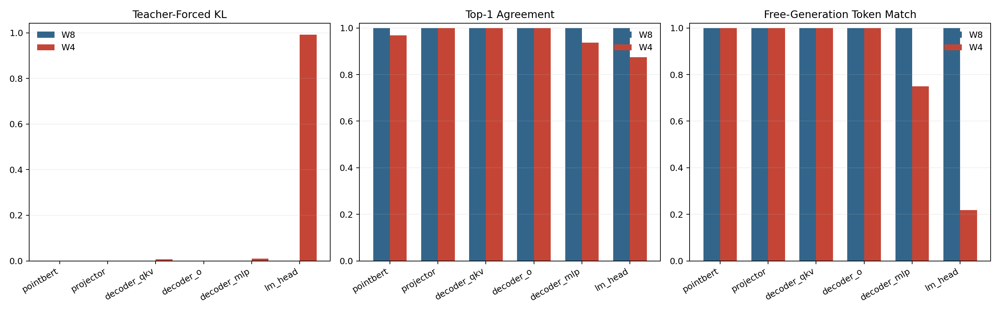

# PointLLM Compression Sensitivity

All measurements use the unmodified PointLLM-7B v1.2 safetensors checkpoint. The source checkpoint is never overwritten. These are quality/oracle experiments, not sparse or quantized runtime speed measurements.

## Neuron-level oracle gate

The exact `|SiLU(gate_i) * up_i| * ||W_down[:, i]||_2` contribution oracle was evaluated at group sizes `B=1/4/8/16/32` on the existing BF16 decode traces.

| Dataset | B | Gini | normalized entropy | effective-support ratio | top-10% retention | neurons for 90% contribution |
|---|---:|---:|---:|---:|---:|---:|
| ModelNet, 2 clouds x 4 prompts x 31 decode passes | 1 | 0.5800 | 0.9313 | 0.5321 | 0.4092 | 0.5221 |
| Objaverse, 1 cloud x 4 prompts x 31 decode passes | 1 | 0.5813 | 0.9308 | 0.5297 | 0.4109 | 0.5214 |
| ModelNet | 32 | - | 0.9933 | 0.9636 | 0.1597 | 0.8519 |

The predeclared stop rule is triggered on both datasets: B=1 retains less than 50% contribution at a 10% budget and needs more than 50% of neurons for 90% contribution. Activation sparsity is therefore closed. Exact permutation/clustering was deliberately not run because no layout can beat the failed arbitrary-neuron oracle.

## Static N:M Wanda

Wanda uses `|W| * sqrt(E[x^2])` from real multimodal calibration and exact row-wise contiguous masks over decoder QKV/O/MLP weights.

| Pattern | decoder sparsity | KL mean | top-1 agreement | free token match | exact request match |
|---|---:|---:|---:|---:|---:|
| 2:4 | 50% | 0.05982 | 93.75% | 50.00% | 50.00% |
| 4:8 | 50% | 0.05045 | 90.63% | 65.63% | 50.00% |

Both patterns already change two of four eight-token generations. Dense PyTorch execution does not realize N:M acceleration. Full SparseGPT reconstruction was not replaced by a diagonal proxy: the 11,008-wide down projection alone needs an approximately 485 MB FP32 Hessian plus Cholesky work per layer, so that run remains a separately budgeted offline experiment.

## Component W8/W4 sensitivity

Weights are independently quantized per output channel, then dequantized to BF16 for dense inference. This isolates weight-rounding sensitivity; it does not test activation quantization or runtime speed. Calibration/evaluation uses two ModelNet objects, two prompts each, and eight generated tokens.

| Component | bits | KL mean | top-1 agreement | free token match | exact request match |
|---|---:|---:|---:|---:|---:|
| PointBERT | W8 | 0.00036 | 100% | 100% | 100% |
| PointBERT | W4 | 0.00123 | 96.88% | 100% | 100% |
| Projector | W8 | 0.00016 | 100% | 100% | 100% |
| Projector | W4 | 0.00148 | 100% | 100% | 100% |
| Decoder QKV | W8 | 0.00022 | 100% | 100% | 100% |
| Decoder QKV | W4 | 0.00643 | 100% | 100% | 100% |
| Decoder O | W8 | 0.00035 | 100% | 100% | 100% |
| Decoder O | W4 | 0.00124 | 100% | 100% | 100% |
| Decoder MLP | W8 | 0.00037 | 100% | 100% | 100% |
| Decoder MLP | W4 | 0.00970 | 93.75% | 75% | 75% |
| LM head | W8 | 0.00036 | 100% | 100% | 100% |
| LM head | W4 | 0.99191 | 87.50% | 21.88% | 0% |

This small calibration set supports W8 as the common safe starting mode. W4 should not be unified across the pipeline: LM head must remain at higher precision, decoder MLP needs additional calibration or mixed precision, while PointBERT/projector/QKV/O are candidates for a larger validation run.

