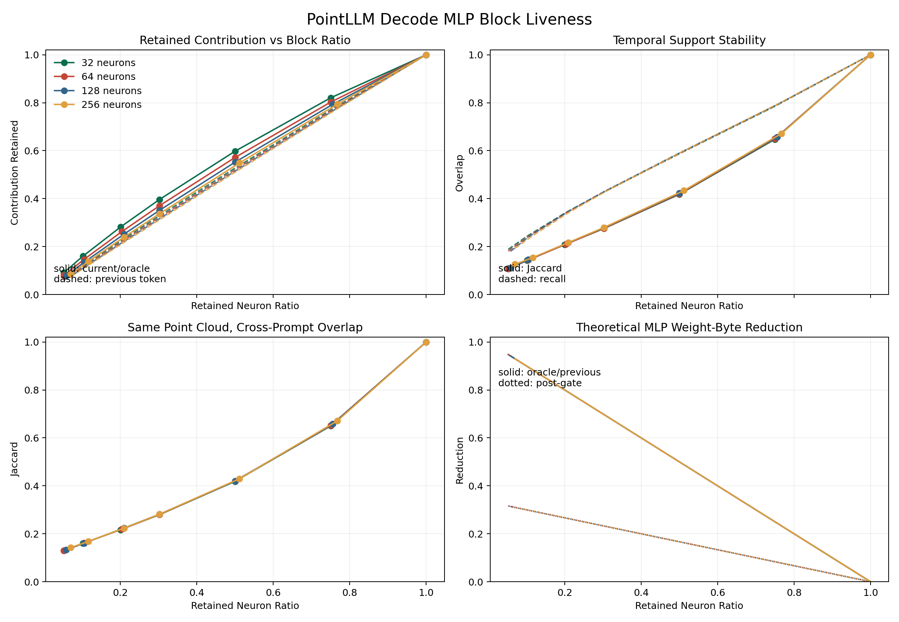
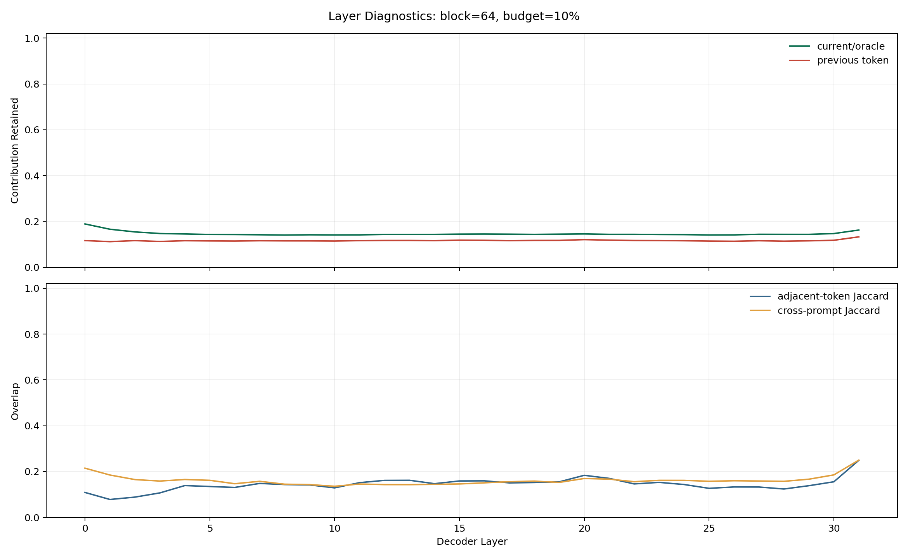
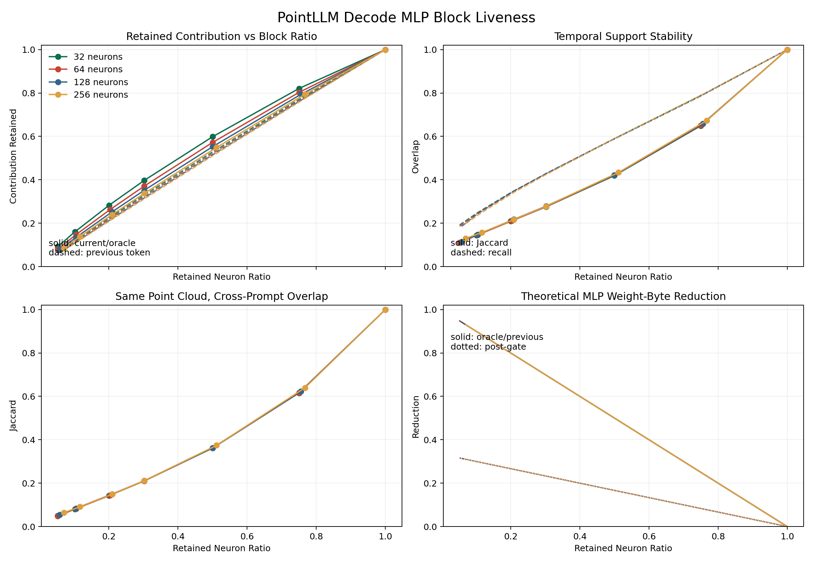

# PointLLM Decode MLP Block Trace

## Setup

- Model: PointLLM-7B v1.2, BF16
- Dataset: 2 real ModelNet test point clouds (seed 0)
- Prompts: 4 prompts per point cloud
- Generation: greedy, 32 generated tokens per request
- Trace: 31 decode passes per request, 32 decoder layers, 7,936 layer-token records
- MLP shape: hidden 4,096, intermediate 11,008
- Blocks: contiguous 32/64/128/256 neurons
- Contribution: `c_i = |SiLU(gate_i) * up_i| * ||W_down[:, i]||_2`; block contribution is the sum inside each block

The first generated token is produced during prefill and is not counted as a decode pass. Raw BF16 activations and compressed per-observation JSONL remain in the ignored local result directory at `/home/nano-pointllm/results/mlp_block_trace/modelnet_n2_p4_t32_bf16/`.

## Main Result

The measured MLP intermediate is not strongly block sparse under contiguous grouping. At 64-neuron blocks and an actual 10.47% neuron budget:

| Metric | Result |
|---|---:|
| Current-token/oracle contribution retained | 14.63% |
| Previous-token contribution retained | 11.63% |
| Adjacent-token support Jaccard | 14.37% |
| Previous-token support recall | 24.23% |
| Same-point-cloud cross-prompt Jaccard | 16.14% |
| Post-gate theoretical weight-byte reduction | 29.84% |
| Oracle/previous theoretical steady-state reduction | 89.53% |

The 89.53% pre-gate number is not an achievable quality result. The oracle support preserves only 14.63% of contribution, while previous-token support preserves 11.63%. It is a traffic upper bound at a severe semantic-compute loss point.

Smaller 32-neuron blocks are consistently better but still weak: retaining 10.17% of neurons preserves 15.97% current contribution. Even a 50% block budget preserves only 59.79% current contribution, and a 75% budget preserves 82.05%. There is no evidence here that a static or previous-token contiguous block mask can remove most MLP weights while preserving the original computation.

## Interpretation

- Post-gate selection has a hard traffic ceiling because gate/up must already run. At a 10% budget it saves only about 30% of total MLP weight bytes, before index and activation overhead.
- Oracle-pre-gate exposes the maximum possible traffic reduction but is non-causal. Its low retained contribution shows that contiguous block structure is the limiting issue, not only predictor quality.
- Previous-token support is causal but unstable. Its 14.37% Jaccard and 24.23% recall at the 64/10% setting are too low for direct reuse without a much larger union or a learned predictor.
- Same-point-cloud cross-prompt overlap is also low, so the point cloud does not define a reusable prompt-independent MLP block mask at this budget.
- Layer 31 is the most temporally stable at 64/10% (Jaccard about 24.90%); layer 1 is the least stable (about 7.80%). Per-layer budgets may help, but do not reverse the global conclusion.

The next useful experiment is neuron permutation/clustering or a learned pre-gate predictor evaluated against this oracle. Implementing a block-sparse kernel before improving support structure would optimize a quality-invalid operating point.

## Objaverse Check

One real Objaverse point cloud was traced with the same four prompts and 32-token generation as a distribution check. At 64-neuron blocks and the same 10.47% actual budget, current contribution retention was 14.67%, previous-token retention was 11.66%, adjacent-token Jaccard was 14.61%, and previous-token recall was 24.61%. These values closely match ModelNet. Same-point-cloud cross-prompt Jaccard fell to 8.20%, making a prompt-independent static mask even less plausible for this object.

This Objaverse run contains only one point cloud and is supporting evidence, not a dataset-level estimate. Its full local output is `/home/nano-pointllm/results/mlp_block_trace/objaverse_n1_p4_t32_bf16/`.

## Artifacts

- `retained_contribution_curves.csv`: global block-size/budget curves
- `layer_curves.csv`: all 32 decoder layers
- `step_curves.csv`: all 31 decode passes
- `mlp_block_trace_overview.png`: contribution, temporal overlap, cross-prompt overlap, and theoretical bytes
- `mlp_block_trace_by_layer.png`: 64-neuron/10% layer diagnostics
- `objaverse_retained_contribution_curves.csv`: one-object Objaverse check
- `objaverse_mlp_block_trace_overview.png`: one-object Objaverse overview

