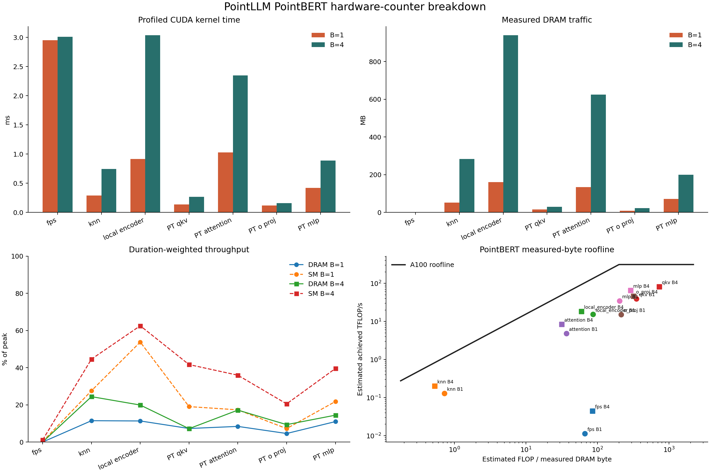

# Strict PointBERT NCU Roofline

This report profiles PointLLM-7B v1.2 PointBERT on an otherwise idle A100-SXM4-40GB. Both B1 and B4 launches passed the pre-NCU idle gate. NCU kernel replay is used only for hardware counters and is not a latency benchmark.

The real shape is `8192 input points -> 512 groups x 32 points -> 513 tokens x 384 channels -> 12 PointTransformer layers / 6 heads`. The ranges are FPS, KNN, complete local encoder, all 12 QKV projections, all 12 eager attention cores, all 12 O projections, and all 12 MLPs.

| Stage | B1 ms | B1 share | B1 DRAM/SM % | B1 measured AI | B4 ms | B4 share | B4 DRAM/SM % | B4 measured AI |
|---|---:|---:|---:|---:|---:|---:|---:|---:|
| FPS | 2.951 | 50.35% | 0.01 / 0.29 | 67.01 | 3.008 | 28.79% | 0.03 / 1.15 | 85.41 |
| KNN | 0.291 | 4.96% | 11.48 / 27.60 | 0.73 | 0.746 | 7.14% | 24.41 / 44.59 | 0.53 |
| Local encoder | 0.914 | 15.60% | 11.34 / 53.77 | 86.87 | 3.036 | 29.06% | 19.90 / 62.52 | 59.55 |
| PT QKV | 0.138 | 2.35% | 7.29 / 19.05 | 350.31 | 0.267 | 2.55% | 7.19 / 41.65 | 732.54 |
| PT attention | 1.028 | 17.54% | 8.41 / 17.32 | 36.94 | 2.347 | 22.47% | 17.17 / 35.94 | 31.64 |
| PT O projection | 0.119 | 2.03% | 4.59 / 7.24 | 214.51 | 0.156 | 1.50% | 9.36 / 20.53 | 320.23 |
| PT MLP | 0.420 | 7.16% | 11.00 / 21.80 | 203.39 | 0.888 | 8.50% | 14.45 / 39.55 | 291.73 |

Measured AI is estimated operation FLOPs divided by NCU-measured DRAM bytes. The A100 ridge is `200.64 FLOP/byte` under the configured 312 TFLOP/s and 1555 GB/s peaks. FPS/KNN FLOPs exclude comparisons, top-k, and indexing; local encoder/PT FLOPs exclude normalization, nonlinearities, and reductions where documented in the JSON. Hardware time, bytes, DRAM %, and SM % are direct NCU counters.

## Interpretation

- FPS is the dominant B1 latency and barely changes at B4. Its 0.29-1.15% SM throughput identifies serial/occupancy inefficiency, not HBM bandwidth, as the first frontend kernel target.
- At B4, local encoder becomes the largest stage and reaches 62.52% SM throughput. Conv/BN/ReLU and pooling fusion plus layout reduction are more relevant than weight-only compression.
- Eager PointTransformer attention is the next structural target: it materializes score tensors, remains below the ridge, and consumes 17.54-22.47% of marked-stage time. A fused SDPA/FlashAttention path is the natural software baseline.
- PT QKV/O/MLP sit at or above the roofline ridge and show DRAM throughput well below decoder GEMV levels. Unlike small-batch LLaMA decode, PointBERT's 513-token GEMMs are not primarily weight-bandwidth-bound.
- KNN has very low measured AI but the dominant work is radix/top-k and irregular operations; a distance+selection fused kernel is more plausible than treating it as a dense roofline GEMM.

